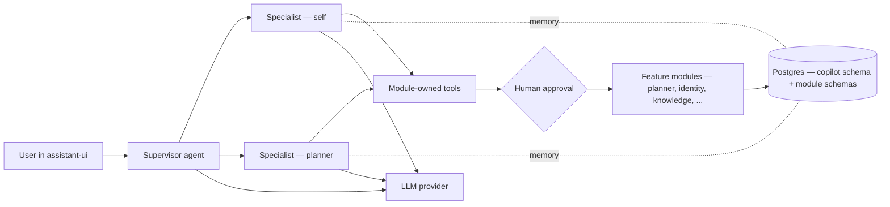
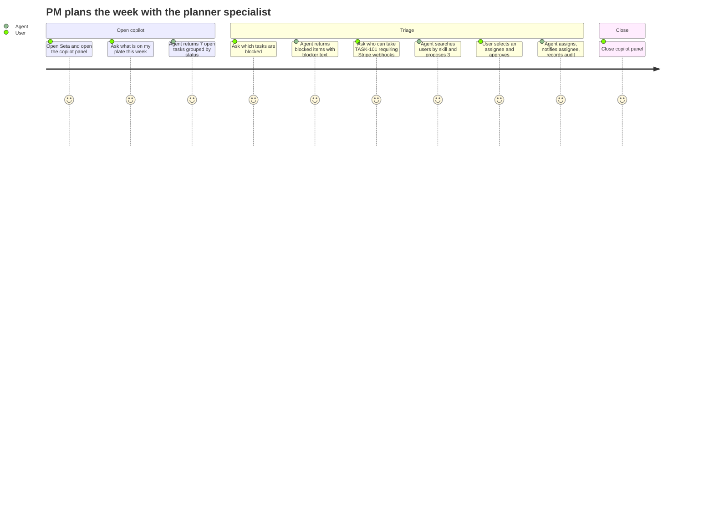
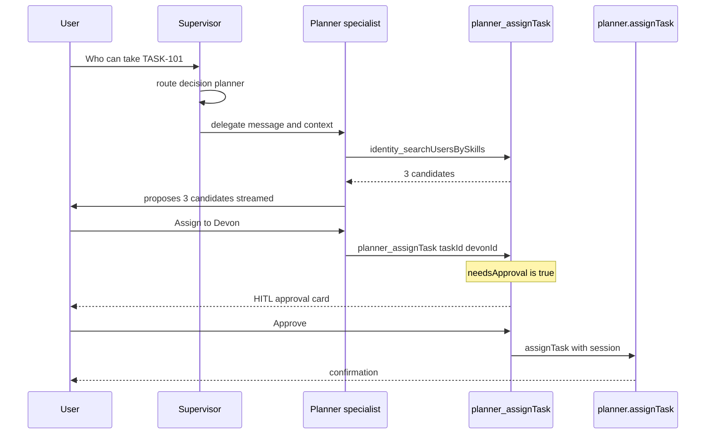
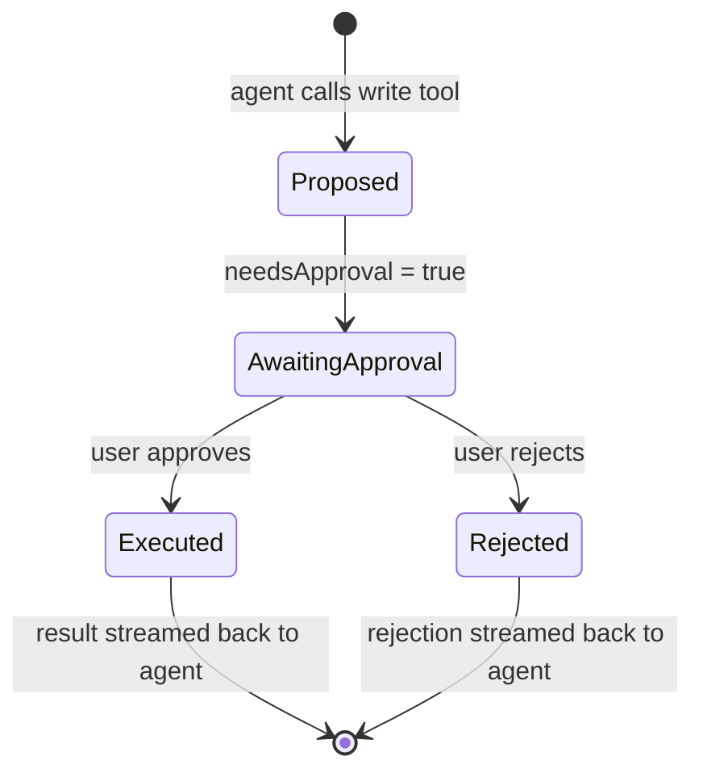
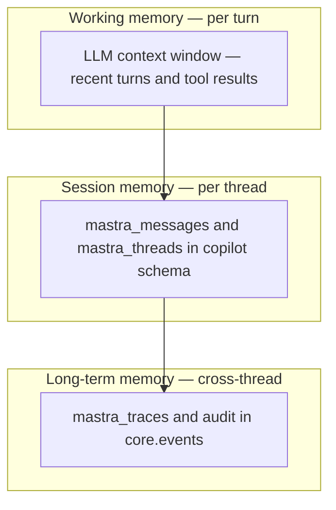
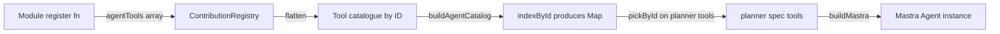
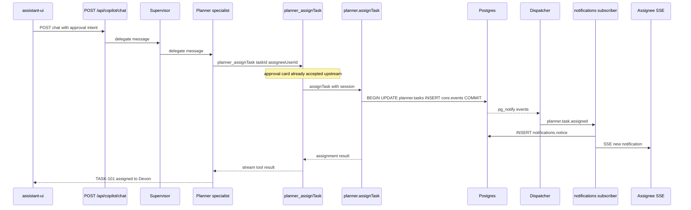
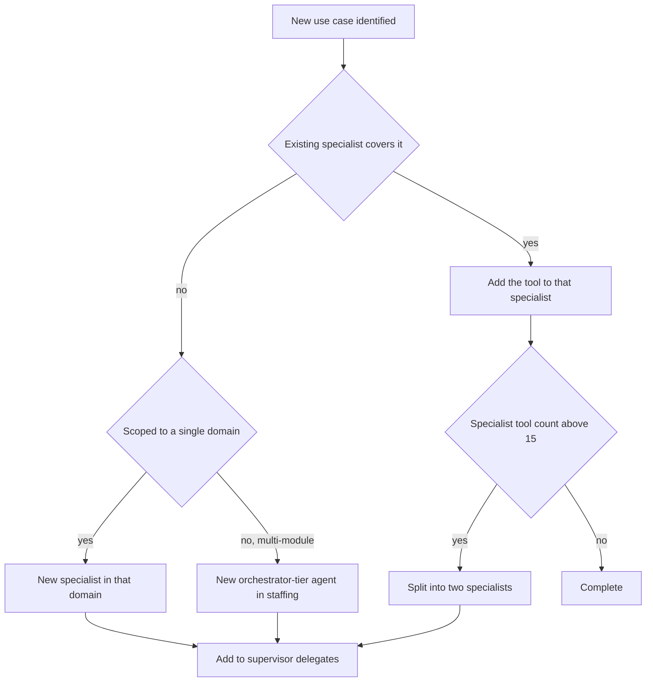

# Agent system (copilot)

Seta's agent system is structured around a **supervisor agent** that routes user requests to domain-scoped **specialists**, each composed from a curated subset of tools surfaced by feature modules. Every write tool is gated by an explicit human-in-the-loop approval; every action is audited through the same event bus as the rest of the platform.

This document explains the design by tracing one realistic workload — planner assignment assistance for a product manager — from user pain point through to implementation. The planner is used as the running example because most feature-module specialists will follow the same arc.

**Related documents.** [`architecture.md`](./architecture.md) describes the surrounding platform shape (modules, event bus, identity). [`tech-stack.md`](./tech-stack.md) records the rationale for Mastra, AI SDK v6, and assistant-ui. [`creating-modules.md`](./creating-modules.md) is the module-author guide.

> **Scope note.** The supervisor and the `self` specialist ship today (`packages/copilot/src/backend/agents/catalog.ts`). The planner specialist used as the worked example is the next specialist on the roadmap; every tool, event, and module surface referenced below already exists in the codebase.

---

## Contents

| Part | Subject |
|---|---|
| [A. Pain point](#part-a--pain-point) | Personas, current-tool gaps |
| [B. Use case](#part-b--use-case) | Target user story and required capabilities |
| [C. Design](#part-c--design) | Supervisor / specialist architecture, HITL boundary, memory model, observability |
| [D. Implementation](#part-d--implementation) | Specialist spec, tool definitions, supervisor wiring, web surface, end-to-end run |
| [E. Production concerns](#part-e--production-concerns) | Failure modes, latency and cost budgets, extension criteria |

---

## Agent system at a glance



| Layer | Responsibility |
|---|---|
| User-facing chat | Message stream, tool-call cards, approval cards rendered by assistant-ui |
| Agent HTTP | A single route bridges the AI SDK v6 stream protocol to Mastra |
| Supervisor | A small routing agent that selects the appropriate specialist |
| Specialist | Domain-scoped Mastra agent composed from approximately fifteen tools and a domain-specific system prompt |
| Tools | Thin adapters over module domain functions, owned by the source module |
| HITL gate | Pauses every write tool for explicit user approval before execution |
| Modules | Perform the actual reads and mutations through their public surfaces |
| Memory | Threads, messages, and traces persisted to the `copilot` Postgres schema, managed by Mastra |
| Audit | Every tool call is recorded in `core.events` alongside domain events |

The rest of this document explains *why* this shape — starting from a concrete user pain — and *how* it is built. Code locations for each layer are listed in §19.

---

# Part A — Pain point

## 1. Affected personas

| Persona | Recurring workload |
|---|---|
| **Product Manager** | Weekly status compilation, re-prioritisation, and ad-hoc capacity queries across multiple ICs. Frequent context switches between board views, chat, and email. |
| **Tech Lead / IC** | Task hygiene (closing stale items, updating status), interrupt-driven status reporting for stakeholders. |
| **Engineering Manager** | Assigning new work to individuals with matching skills and available capacity. Frequently defaults to familiarity heuristics, under-utilising newer team members. |

These workloads are information-retrieval and coordination problems mediated through chat, dashboards, and email. The latency and lossiness of these channels is the cost being optimised.

## 2. Gap analysis

| Existing tool | Limitation for the workloads above |
|---|---|
| Jira / Linear filter views | Surface items by attribute. Cannot answer intent-shaped queries such as "who is free next week with the skills required for a Stripe webhook integration". |
| Team chat | High latency, lossy, recipient must be online. |
| Spreadsheets | Snapshot in time; immediately stale. |
| General-purpose LLM chat (ChatGPT, Claude.ai) | No access to tenant data, no write authority, no audit. |
| LLM with retrieval over docs | Read-only. Cannot assign, update status, or notify. |

The gap is a per-tenant agent that can read the planner, search team members by skill, propose assignments, and apply them after a one-click human approval — with the resulting action audited and the assignee notified through the existing event channels.

---

# Part B — Use case

## 3. Target user story



The target end-to-end duration is approximately five minutes for the full interaction, compared with the 60–90 minutes typically required when the same workflow is performed manually across chat, board views, and email.

## 4. Required capabilities

| Capability | Source module | Side effect | Permission slug |
|---|---|---|---|
| List my tasks | `planner` | read | `planner.task.read` |
| Fetch task detail (blockers, dependencies) | `planner` | read | `planner.task.read` |
| Semantic search across tasks | `planner` (embedding index) | read | `planner.task.read` |
| Search users by skill | `identity` (user profile) | read | `identity.user.read` |
| Propose assignment (requires approval) | `planner` | write to `planner.tasks.assignee_id` | `planner.task.assign` |
| Notify assignee | `notifications` (event-driven projection) | write (via subscriber) | governed by event |
| Audit every action | `core.events` | write (via outbox) | automatic |

---

# Part C — Design

## 5. Architectural alternatives

| Design | Tool catalogue per agent | Prompt cache behaviour | Routing quality | Selected |
|---|---|---|---|---|
| Single agent with the full tool catalogue | Grows past 50 entries as modules are added | Tool schemas in system prompt invalidate the cache on every catalogue change | Degrades as catalogue grows | No |
| One agent per tool (router-only composition) | One tool per agent | Minimal prompt, optimal cache | No surface for domain reasoning | No |
| **Supervisor + specialists** | Approximately 15 tools per specialist; supervisor delegates | Specialist prompt caches per session and rarely changes | Supervisor selects specialist by description; specialist selects tool by description | **Yes** |

## 6. Supervisor request flow



## 7. Specialist composition

A specialist is a Mastra `Agent` instance composed from a domain-specific system prompt, a tool subset resolved by ID at boot, a memory store, a model tier, and an LRU runtime cache:

| Ingredient | Source | Scope |
|---|---|---|
| System prompt | `agent-specs.ts` `instructions` field | Per specialist |
| Tool set | `agent-specs.ts` `tools` field (resolved at boot by ID) | Per specialist |
| Memory store | `@mastra/pg` `PostgresStore({ schemaName: 'copilot' })` | Shared store, per-thread scope |
| Model tier | `defaultTier: 'fast' \| 'smart'` (request override permitted) | Per specialist |
| Runtime cache | LRU keyed on the resolved role set hash | Shared across specialists |

## 8. Tool catalogue and RBAC binding

The planner specialist composes tools owned by four modules. Tool IDs are globally unique; the contribution registry validates resolution at boot.

| Tool ID | Owning module | Side effect | Permission |
|---|---|---|---|
| `planner_getTask` | `planner` | read | `planner.task.read` |
| `search_tasks_semantic` | `planner` | read | `planner.task.read` |
| `planner_assignTask` | `planner` | write | `planner.task.assign` |
| `identity_searchUsersBySkills` | `identity` | read | `identity.user.read` |
| `match_users_to_topic` | `staffing` | read | `staffing.match.read` |
| `core_serverTime` | `core` | read | (none) |

The user's `effective_permissions` set, established at session creation, gates which tools are visible to the specialist at runtime. A tool whose RBAC slug the user does not hold is filtered out before the catalogue is bound to the agent.

## 9. Human-in-the-loop boundary

All write tools set `needsApproval: true`. AI SDK v6 pauses the tool call; assistant-ui renders an Interactable approval card derived from the tool's input schema; the user accepts (optionally after editing arguments) or rejects.



| Property | Behaviour |
|---|---|
| Read tools | Execute directly without approval |
| Write tools | Always require approval — no per-tool override |
| Approval surface | Form rendered from input schema; arguments are editable before approval |
| Rejection | Streamed back as a tool error; agent may re-plan |
| Audit | Both proposed and executed calls are persisted to `core.events` |

The approval boundary is a trust contract, not a UX option: agent-driven mutations always present the proposed action to the user before commit.

## 10. Memory model



| Layer | Lifetime | Storage | Contents |
|---|---|---|---|
| Working | One turn | LLM context window | Recent messages, current tool results |
| Session | Per thread | `copilot.mastra_messages`, `copilot.mastra_threads` (managed by Mastra) | Full conversation history including tool calls |
| Long-term | Subject to event retention | `core.events` | Tool execution audits and emitted domain events |

The `mastra_*` tables are owned by Mastra; their DDL is not edited by hand. They reside in the `copilot` schema so that backup and migration operations cover them with the rest of the platform. Audit is not a separate subsystem — the long-term layer above is `core.events`, persisted in the same transaction as the domain mutation, queried by event type or tool metadata.

---

# Part D — Implementation

## 11. Planner specialist specification

```ts
// packages/copilot/src/backend/agents/catalog.ts (extended)
const planner: AgentSpec = {
  name: 'planner',
  label: 'Planner',
  description: 'Reads, searches, and assigns planner tasks. Proposes mutations; the user approves.',
  instructions: PLANNER_INSTRUCTIONS,
  tools: pickById(byId, [
    'planner_getTask',
    'search_tasks_semantic',
    'planner_assignTask',
    'identity_searchUsersBySkills',
    'core_serverTime',
  ]),
  defaultTier: 'smart',
};

const supervisor: AgentSpec = {
  // ...
  delegates: ['self', 'planner'],
};

return [self, planner, supervisor];
```

### Tool resolution at boot



| Failure condition | Boot outcome |
|---|---|
| Tool ID typo (`planner_assingTask`) | Throws `tool not registered` |
| Tool removed from a module | Throws `tool not registered` |
| Module disabled in `SETA_MODULES` | `pickByIdSoft` permits specialist to build without the tool; specialist runs degraded |
| Permission slug mismatch | Rejected by contribution registry validation |

## 12. Planner tool definitions

Tool definitions reside in `packages/planner/src/backend/agent-tools/`. Each tool is a thin adapter over a `domain/*.ts` function — the agent execution path and the HTTP execution path call the same business logic.

| Tool ID | File | Wraps | RBAC | needsApproval |
|---|---|---|---|---|
| `planner_getTask` | `get-task.ts` | `getTask` | `planner.task.read` | false |
| `search_tasks_semantic` | `search-tasks-semantic.ts` | `searchTasksSemantic` | `planner.task.read` | false |
| `planner_assignTask` | `assign-task.ts` | `assignTask` | `planner.task.assign` | **true** |
| `identity_searchUsersBySkills` | `search-users-by-skills.ts` | `searchUsersBySkills` | `identity.user.read` | false |

The `planner_assignTask` definition illustrates the production shape — a `defineCopilotTool` call that binds `id`, `description`, input/output schemas, `rbac`, and `needsApproval` in a single declaration, with `execute` resolving the session from runtime context before delegating to the domain function:

```ts
export const plannerAssignTaskTool = defineCopilotTool({
  id: 'planner_assignTask',
  name: 'Assign Task',
  description: 'Assign a user to a task.',
  input: z.object({
    taskId: z.string().uuid().describe('The task ID'),
    assigneeUserId: z.string().uuid().describe('The user ID to assign'),
  }),
  output: z.object({ assignment: z.object({ taskId: z.string(), assigneeUserId: z.string() }) }),
  rbac: 'planner.task.assign',
  needsApproval: true,
  execute: async (input, ctx) => {
    const session = await buildActorSession(actorFromContext(ctx));
    await assignTask({ task_id: input.taskId, user_id: input.assigneeUserId, session });
    return { assignment: { taskId: input.taskId, assigneeUserId: input.assigneeUserId } };
  },
});
```

## 13. Supervisor wiring

```ts
// packages/copilot/src/backend/agents/catalog.ts
export function buildAgentCatalog(deps: {
  mastra: Mastra;
  pool: Pool;
  agentTools: ReadonlyArray<CopilotTool>;
}): AgentSpecs {
  const byId = indexById(deps.agentTools);
  // ... self, planner specifications ...
  const supervisor: AgentSpec = {
    name: 'supervisor',
    label: 'Supervisor',
    description: 'Routes the user request to the appropriate specialist.',
    instructions: ROUTER_INSTRUCTIONS,
    tools: pickByIdSoft(byId, ['staffing_runNewTaskSkillTag']),
    delegates: ['self', 'planner'],
    defaultTier: 'fast',
  };
  return [self, planner, supervisor];
}
```

| Boot-time validation | Effect |
|---|---|
| Every entry in `tools[]` resolves through `byId` | Pass or fail |
| Every entry in `delegates[]` is the name of a specification in the returned list | Pass or fail |
| Every tool RBAC slug is registered in a module's `rbac` declaration | Pass or fail |
| Specification `name` fields are unique | Pass or fail |

## 14. Web surface

The chat panel is anchored to the right edge of the application shell. The Interactable approval card is rendered inline within the conversation, derived from the tool's input schema.

```
┌────────────────────────────────────────────────────────────┐
│ Copilot                                  [Planner ▾]  [×]  │
├────────────────────────────────────────────────────────────┤
│ User:    who can pick up TASK-101 - Stripe webhooks?       │
│ Planner: candidates - Devon, Aki, Sam                      │
│                                                            │
│ ┌────────────────────────────────────────────────────────┐ │
│ │ Approval required: planner_assignTask                  │ │
│ │ taskId         TASK-101                                │ │
│ │ assigneeUserId Devon                                   │ │
│ │                       [ Reject ]   [ Approve  ⏎ ]      │ │
│ └────────────────────────────────────────────────────────┘ │
│                                                            │
│ [ Compose message...                                   ↵ ] │
└────────────────────────────────────────────────────────────┘
```

| UI element | Source library |
|---|---|
| Panel shell | `@assistant-ui/react` |
| Message stream | `@ai-sdk/react` `useChat` with `@assistant-ui/react-ai-sdk` adapter |
| Tool-call card | `@assistant-ui/react` `<ToolCallContentPart>` |
| Approval card | assistant-ui Interactable, parameterised by the tool input schema |
| Markdown rendering | `@assistant-ui/react-markdown` |
| Specialist selector | Local component reading `userVisible` from the agent catalogue |

The panel communicates with the backend through a single Hono route (`/api/copilot/chat`); the route uses `@mastra/ai-sdk` to bridge Mastra's stream protocol to AI SDK v6's stream protocol.

## 15. End-to-end execution

The full path from user approval to assignee notification:



The p95 latency budget for this flow is approximately 1.2 s from approval click to the confirmation message, with an additional ~150 ms for the SSE notification to reach the assignee.

---

# Part E — Production concerns

## 16. Failure modes

| Failure | Detection | Recovery |
|---|---|---|
| LLM provider unavailable | Provider error returned to the tool layer; AI SDK v6 retries on transient errors | Model registry fails over to the backup provider in the same tier |
| Tool implementation raises an unexpected exception | Mastra captures the exception and streams a tool error to the agent | Agent receives the error in context and re-plans or surfaces it to the user |
| User rejects approval | AI SDK v6 streams the rejection as a tool result | Agent receives the rejection and suggests alternatives |
| Dispatcher lag increases | `/health/ready` reports backlog | Scale `apps/worker`; investigate slow subscribers |
| Long-running tool blocks the specialist | Mastra timeout (default 60 s) | Tool returns timeout; agent re-plans |
| Stale agent cache after an RBAC change | LRU keyed on role-set hash | Permission change invalidates the cache entry on the next request |
| Mastra memory store unreachable at boot | Readiness probe red; boot fails | Cluster does not accept traffic — fail fast |
| Embedding job backlog | `embed_<entity>` job count in observability | Scale workers; throttle source; defer backfill |

## 17. Latency and cost budget

Per-turn p95 budget for the planner specialist:

| Stage | Latency | Token cost (smart tier) | Notes |
|---|---|---|---|
| Supervisor route | 150 ms | ~150 in, ~30 out | Fast tier model |
| Specialist plan | 500 ms | ~800 in, ~200 out | Smart tier; tool schemas in prompt |
| `search_tasks_semantic` | 250 ms | — | Stage 1 RRF + Stage 2 Cohere rerank |
| `identity_searchUsersBySkills` | 80 ms | — | Indexed query |
| `planner_assignTask` (post-approval) | 50 ms | — | Single transaction |
| Summary stream back to UI | 200 ms | ~300 in, ~150 out | Smart tier |
| **Total per turn** | **~1.2 s** | **~2 k tokens** | |

| Cost lever | Effect |
|---|---|
| Drop specialist to `fast` tier | ~40 % cost reduction, ~30 % latency reduction, modest reduction in assignment reasoning quality |
| Disable rerank (`stage2: 'none'`) | ~150 ms saved; recall@10 drops 8–12 % |
| Cap thread context to last N messages | Linear reduction in token cost |
| Provider prompt caching (AI SDK v6) | First turn unaffected; subsequent turns benefit from cache hits |

## 18. Extension criteria — when to add a specialist



| Precondition before merging a new specialist |
|---|
| All capabilities have a public function in the owning module |
| Each capability has a tool wrapper in that module's `agent-tools/` |
| Write tools set `needsApproval: true` |
| RBAC slugs are registered in `<module>/src/rbac.ts` |
| Specialist `tools[]` contains no more than 15 entries |
| Specialist `description` reads as a job title rather than a feature list |
| Supervisor `delegates[]` includes the new specialist |
| At least one integration test exercises the supervisor → specialist → tool → database path |
| Latency and cost budget recorded in §17 |

## 19. Code locations

| Concept | File |
|---|---|
| Tool contract (no runtime dependency on `@mastra/*`) | `sdks/copilot/src/index.ts` |
| `defineCopilotTool` definition | `sdks/copilot/src/index.ts` |
| Agent specifications and catalogue assembly | `packages/copilot/src/backend/agents/catalog.ts` |
| `AgentSpec` type | `packages/copilot/src/backend/agents/specs.ts` |
| Supervisor and specialist system prompts | `packages/copilot/src/backend/instructions.ts` |
| Mastra build, memory wiring, LRU cache | `packages/copilot/src/backend/runtime.ts`, `agent-factory.ts` |
| Model tier registry | `packages/copilot/src/backend/model-registry.ts` |
| RBAC tool filter | `packages/copilot/src/backend/rbac-filter.ts` |
| Reference planner tools | `packages/planner/src/backend/agent-tools/` |
| Chat HTTP route | `packages/copilot/src/backend/routes.ts` |
| Mastra source (API reference) | `/Users/canh/Projects/Seta/mastra/` (sibling checkout) |
| Mastra playground (UX reference for chat and uploads) | `/Users/canh/Projects/Seta/mastra/packages/playground-ui/` |

---

## Related documents

- [`architecture.md`](./architecture.md) — surrounding platform shape.
- [`tech-stack.md`](./tech-stack.md) — rationale for Mastra, AI SDK v6, assistant-ui.
- [`creating-modules.md`](./creating-modules.md) — adding a module and its agent tools.
